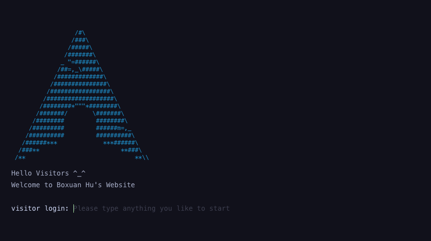
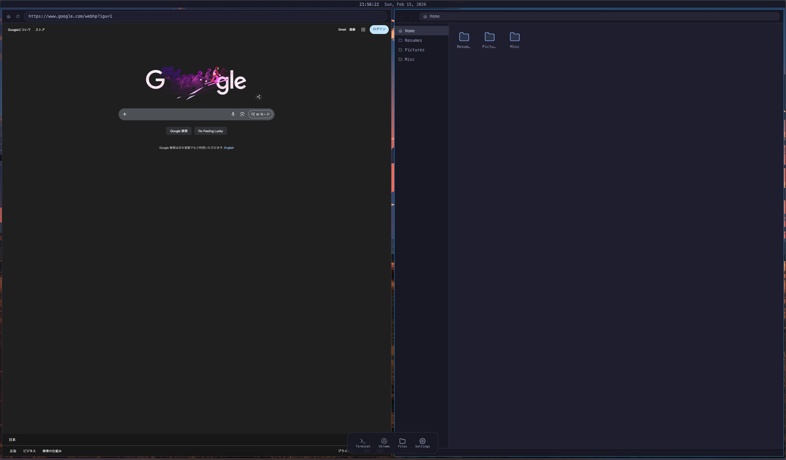
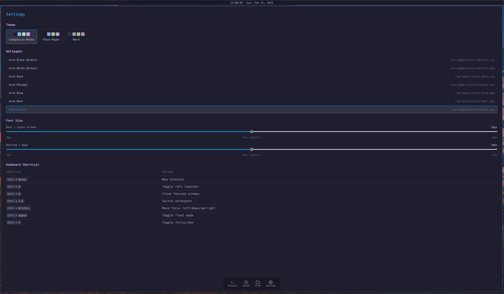

# Arch Linux Desktop Simulation

A personal portfolio website simulating an **Arch Linux + Hyprland** tiling window manager desktop environment, built with Next.js and React.

[中文文档](./README-CN.md)

<table>
  <tr>
    <td width="50%">
      
    </td>
    <td width="50%">
      
    </td>
  </tr>
  <tr>
    <td width="50%">
      
    </td>
    <td width="50%">
      
    </td>
  </tr>
</table>

> [!IMPORTANT]
> **This repository is currently under heavy construction.** 
>
> We warmly welcome your suggestions and invite you to join our list of contributors!

## Tech Stack

- **Next.js 14** (App Router) + TypeScript + React 18
- **Tailwind CSS** with Catppuccin Mocha color palette
- **Zustand** for state management
- **Framer Motion** for animations
- **Static Export** for GitHub Pages deployment

## Features

- **Boot Sequence** — Systemd-style boot animation with TTY login prompt
- **Tiling Window Manager** — Binary tree layout with draggable split handles and 6px gaps
- **Terminal Emulator** — Functional shell with `ls`, `cd`, `cat`, `neofetch`, `pacman` and more
- **File Manager** — Folder navigation and file operations
- **Chrome Browser** — Embedded iframe browser with URL bar and navigation
- **App Launcher** — Rofi-style overlay to search and launch apps
- **Multiple Workspaces** — Switch between 5 independent workspaces
- **Floating Windows** — Toggle windows between tiled and floating mode

## Getting Started

**For Users:**

```bash
# Clone the repository
git clone https://github.com/root-hbx/archlinux-web.git
cd archlinux-web

# Install dependencies
npm install

# Start development server
npm run dev
```

Open [http://localhost:3000](http://localhost:3000) in your browser.

**How to Build (for developers):**

```bash
# Build for production (static export)
npm run build

# Output is in the /out directory
```

## Project Structure

| Shortcut | Action |
|---|---|
| `Ctrl + Enter` | New terminal |
| `Ctrl + D` | Toggle app launcher |
| `Ctrl + Q` | Close focused window |
| `Ctrl + 1-5` | Switch workspace |
| `Ctrl + H/J/K/L` | Move focus (vim keys) |
| `Ctrl + Space` | Toggle float mode |
| `Ctrl + F` | Toggle fullscreen |

```
src/
├── app/                  # Next.js App Router
├── components/
│   ├── apps/             # Terminal, Browser, Settings, etc.
│   ├── boot/             # Boot screen & login prompt
│   ├── desktop/          # Top bar, bottom dock, wallpaper
│   ├── launcher/         # Rofi app launcher
│   └── wm/               # Tiling layout, tile nodes, split handles
├── hooks/                # Keyboard shortcuts
├── lib/
│   ├── terminal/         # Virtual filesystem, commands, neofetch
│   └── wm/               # Binary tree & layout computation
├── store/                # Zustand stores
└── types/
```

## Acknowledgements

This project is inspired by:

* [Ubuntu20.04 Web Simu](https://github.com/vivek9patel/vivek9patel.github.io): Web simulation of Ubuntu 20.04, made using NEXT.js & tailwind CSS
* [Deepin Web Simu](https://github.com/GoodManWEN/GoodManWEN.github.io): Website simulating linux system's GUI, using theme of Deepin distro
* [Kali Linux Web Simu](https://github.com/Ali-Abo-Alshamlat/ali-abo-alshamlat.github.io): Personal portfolio website of theme Kali Linux, made using NEXT.js & tailwind CSS
* [Terminal Portfolio](https://github.com/satnaing/terminal-portfolio): Terminal style portfolio website built with React, TypeScript and Styled-Components
* [Fake Terminal Website](https://github.com/luisbraganca/fake-terminal-website): A fully customizable terminal-like website template
* [Hacker-Blog](https://github.com/tocttou/hacker-blog): A minimalistic, responsive jekyll theme built for hackers

## License

MIT
